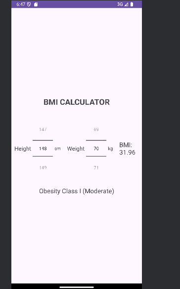

# BMI Calculator

This is a simple Android application designed to calculate Body Mass Index (BMI) based on the user's height and weight. The app provides instant feedback on the user's health status based on the BMI value.

## Features

- **Height Input**: Users can scroll to pick their height (in centimeters) using an intuitive `NumberPicker` widget.
- **Weight Input**: Users can scroll to select their weight (in kilograms) using an intuitive `NumberPicker` widget.
- **Real-time Calculation**: The BMI is calculated automatically as soon as the height or weight is adjusted, with the result displayed immediately on the screen.
- **Health Status Feedback**: Based on the calculated BMI, the app provides a health status message according to the following categories:
  - **Severely Underweight**
  - **Underweight**
  - **Normal (Healthy)**
  - **Overweight**
  - **Obesity Class I (Moderate)**
  - **Obesity Class II (Severe)**
  - **Obesity Class III (Very Severe or Morbidly Obese)**

## Screenshot




## Installation

1. Clone this repository to your local machine using:
    ```bash
    git clone https://github.com/plokoon343/KOTLIN_BMI_PROJECT.git
    ```
2. Open the project in Android Studio.
3. Build and run the app on an emulator or physical device.

## Usage

1. Scroll to select your height and weight using the `NumberPicker` widgets.
2. The BMI and corresponding health status will be displayed automatically as you adjust the values.

## Contributing

If you want to contribute to this project, feel free to open an issue or submit a pull request.

## Group Members

- Onukogu Chidumebi
- Oluwuyi Olumide Ismail
- Omola Israel Chukwuyem 			
- Omomeji Victor Oluwagbotemi
- Oloruntoba David Olalekan
- Otuonye Chidubem David
- Omotoso Oluwatise Michael
- Onokpise Joel
- Omodon Efeabianim Emmanuel 			
- Orekoya-Abiola Adeyitobi Daniel  			


## License

This project is licensed under the MIT License - see the [LICENSE](LICENSE) file for details.
